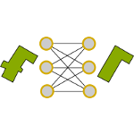

# DeepMapGen

DeepMapGen is a Python library for deep learning based map generalisation mainly developed in the [Geovis team][1] of the [LASTIG lab][2] in France.

DeepMapGen unites several projects that make use of deep learning for map generalization purposes. DeepMapGen contains the following projects:
* [DeepInterchange][3]: classification and segmentation to detect highway interchanges in vector road networks.
* [DeepMountainRoads][4]: classification and segmentation to detect highway interchanges in vector road networks.
* [DeepMapContent][5]: inference of the scale, extent, and content of a map, using classification techniques on its image.

[1]: https://umrlastig.github.io/geovis/
[2]: https://umrlastig.github.io/
[3]: DeepInterchange.md
[4]: DeepMountainRoads.md
[5]: DeepMapContent.md
